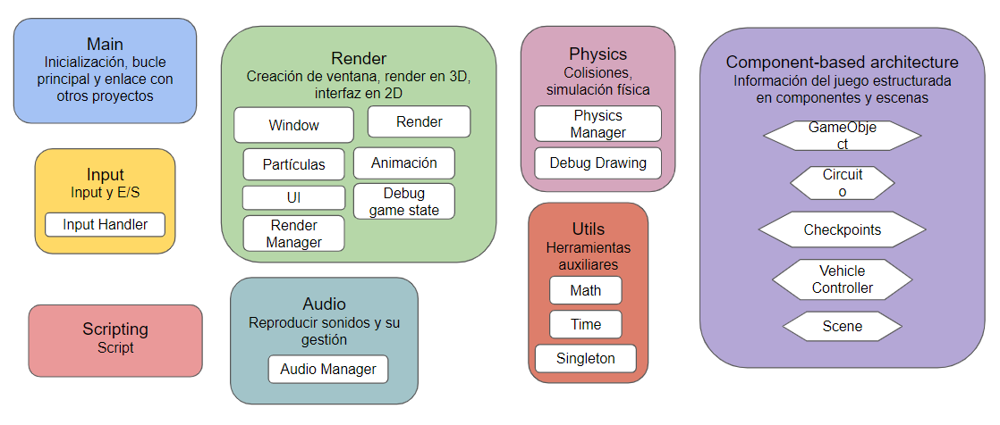
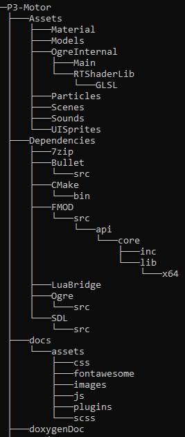
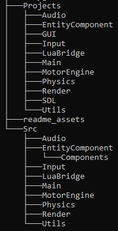
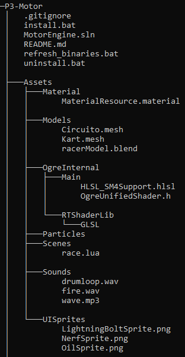
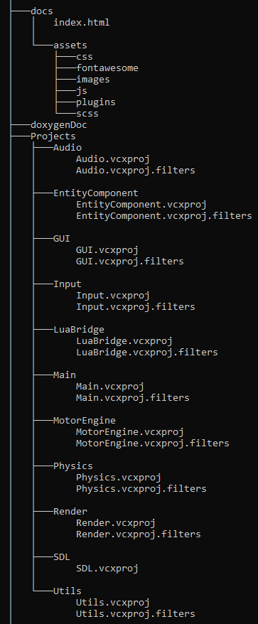
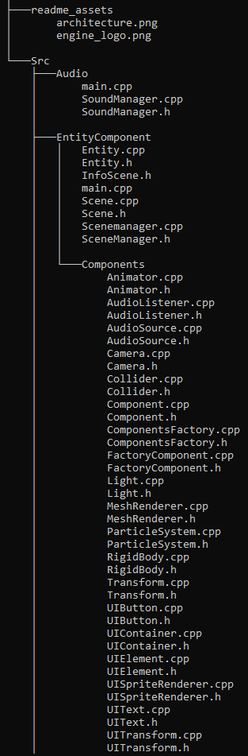
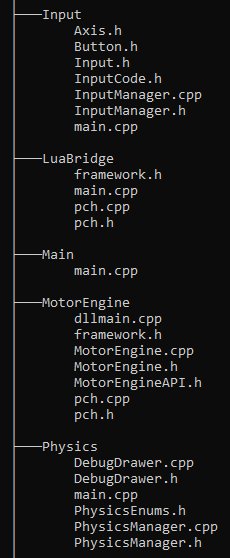
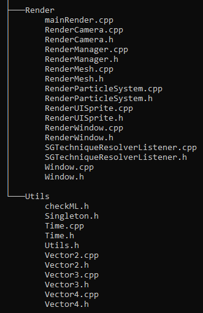

# P3-Motor
Motor de videojuegos desarrollado como parte de la asignatura Proyectos III en el grado de Desarrollo de Videojuegos de la UCM.  
> video instalación: https://youtu.be/7sqyf1AYlrs

## <p align="center">**MOTOR ENGINE**</p>
<div align="center">
    
</div>

* Javier Cano Salcedo, jacano01@ucm.es 
* José Miguel Villacañas, josemv03@ucm.es 
* Pablo Arredondo Nowak, pablarre@ucm.es
* Rodrigo Cabello Hernández, rodricab@ucm.es
* Alfonso Rodulfo Guío, arodulfo@ucm.es
* Diego Rol Sánchez, drol@ucm.es 
* Pedro Pablo Cubells Talavera, pablocub@ucm.es 
* Liyuan Li, liyli@ucm.es

## <p align="center">**LINKS DE INTERÉS**</p>

<div align="center">
  <a href="https://www.pivotaltracker.com/n/projects/2630589">
    
  </a>
</div>

|**Hitos**| |
| ------ | ----------- |
| 0. Propuesta del concepto: 13 de febrero de 2023  | 1. Arquitectura base: 6 de marzo de 2023  |
|2. Ciclo de juego: 27 de marzo de 2023 | 3. Release: 5 de mayo de 2023 |

## Estructura de clases del motor
MotorEngine es un motor de videojuegos concebido para crear videojuegos de carreras. El cual está compuesto por una serie de módulos que gestionan las diferentes áreas del funcionamiento del motor. Finalmente, cada uno de estos contiene un fichero de cabecera (.h) declarando todas las clases y métodos que define dicho módulo, y un main.cpp que testea el correcto funcionamiento del módulo en modo DEBUG.  

Todos los métodos presentados a continución en cada módulo, se encuentran comentados en sus respectivos fichero de cabecera.  

MÓDULOS:
- [MotorEngine](#motorengine)  
- [Components](#components)  
- [Render](#render)  
- [Physics](#physics)  
- [Input](#input)  
- [Audio](#audio)  
- [Utils](#utils)  
- [Scripting](#scripting)  

### MotorEngine
Es el proyecto principal y hace de nudo conector para todos los módulos; además realiza las funciones que determinan el flujo de ejecución de los juegos que se construyan con este motor.  

MotorEngine se encarga de crear todos los módulos del proyecto necesarios para el motor, ejecuta el bucle principal (encargado de la ejecución de la física y el render con distintos cronómetros) y elimina toda la memoria creada en la ejecución del motor.  

En la función principal (main.cpp) se encuentran las funciones siguientes:  
(Su descripción está comentada en el código)  
```
int setup();  
void loop();  
void exit();  
```

Además, en el namespace propio de MotorEngine, el módulo define los siguientes métodos y funciones, cuya descripción también está definida en el encabezado.

```
void updateTimeValues(const std::chrono::steady_clock::time_point& beginFrame,const std::chrono::steady_clock::time_point& endFrame, const std::chrono::steady_clock::time_point& gameStartFrame);
static int quitLoop(void* userdata, SDL_Event* event);
```

### Components
La arquitectura que usa el motor para gestionar las entidades está basada en componentes y escenas.    

El proyecto EntityComponent incorpora la clase SceneManager, un singleton que se encarga de gestionar las escenas y de realizar los cambios de escena.  

Tanto este manager como las escenas utilizan una estructura de datos basada en un unordered_map que permite mediante el nombre de la instancia acceder, añadir y/o eliminar elementos con tiempo constante, que según nuestro análisis parece ser lo más robusto y eficiente.  

El uso shared_ptr es una forma controlada de gestionar la memoria dinámica, permitiéndo tener una referencia al mismo puntero en más de un lugar al mismo tiempo y si se eliminan todas las referencias, la instancia es eliminada automáticamente. Esto es útil para acceder a las escenas desde fuera y que las modificaciones externas afecten a la referencia original, también para poder posponer la adición a la estructura y hacerlo de una más controlada mediante estructuras auxiliares como en el caso de la escenas que es un vector.  

Métodos y datos principales del SceneManager:  
```
std::shared_ptr<Scene> addScene(const std::string& name);  
void removeScene(const std::string& name);  
std::shared_ptr<Scene> getScene(const std::string& name) const;  
inline std::shared_ptr<Scene> getActiveScene() const;  
void setActiveScene(const std::string& name);  
void update();  
---
std::unordered_map<std::string, std::shared_ptr<Scene>> mScenes;  
std::shared_ptr<Scene> mActiveScene;  
```

Las escenas son wrappers de entidades y estas a su vez de componentes. Cada escena contiene una serie de entidades cuya información y comportamiento se define en base a los componentes. Esta a su vez se encargan de gestionar la creación / eliminación de entidades en la escena y de su actualización.

Métodos y datos principales de las escenas:  
```
std::shared_ptr<Entity> addEntity(const EntityName name);  
void removeEntity(const EntityName& name);  
std::shared_ptr<Entity> findEntity(const EntityName& name) const;  
virtual void start();  
void update();  
void lateUpdate();  
void refresh();  
void processNewEntities();  
---
std::vector<std::shared_ptr<Entity>> mNewEntities;  
std::unordered_map<EntityName, std::shared_ptr<Entity>> mEntities;  
```

Las entidades se encargan de gestionar la creación / eliminación de los componentes que la definen y de su actualización. Además, estas se suscriben automáticamente a la escucha (patron observer) de los eventos de colisión del motor de físicas, y el componente Collider las habilita para hacer llamadas a sus respectivas respuestas.  

Estas también utilizan una estructura similar pero en este caso en un map (ordenado) para gestionar los componentes que utilizan. Al mismo tiempo guardan una referencia de la escena a la que pertenecen.  

Métodos y datos principales de las entidades:  
```
Component* addComponent(const ComponentName& componentName, Parameters& params);  
template<typename T>  
T* addComponent(const ComponentName& componentName);  
template<typename T>  
bool removeComponent(ComponentName& component);  
template<typename T>  
inline T* getComponent(const ComponentName& component);  
inline bool hasComponent(const ComponentName& component);  
void start();  
void update();  
void lateUpdate();  
void OnCollisionEnter(Entity* other);  
void OnCollisionStay(Entity* other);
void OnCollisionExit(Entity* other);  
---
Scene* mScn;  
std::map<ComponentName, Component*> mComponents;  
```

Por último (y no menos importante) los componentes son los encargados de realizar y definir el comportamiento de los distintos elementos que conforman nuestro proyecto, por tanto, recae una parte importante del peso sobre ellos, pues definirán el comportamiento del juego / proyecto en general al combinarse, y, harán de puente entre los distintos motores al describir las funciones que realizan esas partes que requieren de los distintos motores y por tanto conllevan las dependencias de estos.  

Estos guardan una referencia a la entidad a la que pertenecen y un booleano que indica si están activos.  

Métodos y datos principales de los componentes:  
```
virtual void start();  
virtual void update();  
virtual void lateUpdate();  
virtual void OnCollisionEnter(Entity* other);  
virtual void OnCollisionStay(Entity* other);  
virtual void OnCollisionExit(Entity* other);  
---
Entity* mEntity;  
bool enabled = true;  
```

Los componente más importante sin duda son Transform, MeshRenderer y Rigidbody ya que sitúan en un punto concreto del espacio los distintos objetos, los muestran por pantalla y calculan sus movimientos y colisiones.   

| Componente | Descripción |
| ------ | ----------- |
| Transform | Este componente posee los métodos set de distintas características (posición, escala y rotación), de la misma forma tiene métodos get de las mismas características. Por otro lado puede añadir como hijo propio uno o varios Transform de otra / otras entidades o eliminarlo(s). También puede contar los hijos que tiene, devolver quién es su padre o quienes son sus hijos. |
| RigidBody | Este componente posee los métodos set de distintas cualidades (masa, trigger, fricción y restitución). La constructora simplemente asigna la información recibida, el start por su parte es el que le da la información al physics manager para poder darle presencia en el mundo. También puede aplicar un impulso o una fuerza. |
| MeshRenderer | Este componente posee los métodos setter y getter de los distintos atributos (mesh y material). Define la forma y la textura del objeto y lo muestra por pantalla. |
| AudioPlayer | Este componente posee los métodos setter y getter de las distintas propiedades (source, volume, isPlaying, loop, is3D y playOnStart). Se encarga de reproducir distintos fragmentos de audio según el objeto al que pertenece. Permite comprobar si ya está en ejecución, aplicar un volumen propio, ejecutar varias veces seguidas y ejecutar nada más se crea la instancia. |
| AudioListener | Este componente posee los métodos setter y getter de las distintas propiedades (index y range). Ofrece a los objetos la cualidad de escuchar a otros objetos según sus sonidos y la distancia a la que se encuentran. |
| Animator | Este componente posee los métodos setter y getter de las distintas propiedades (currentState, statesMap, mesh y stop). Ofrece a los objetos la cualidad de manipular su MeshRenderer para modificar el mesh acorde a una animación preestablecida en el mapa de posibles animaciones. Se puede averiguar en cual te encuentras y cambiar de una a otra, también se puede pausar y no realizar ninguna animación. |
| Collider | Este componente habilita en la entidad la escucha de los eventos del motor de físicas (onCollisionEnter, onCollisionStay y onCollisionExit) |

### Render
El módulo de render incorpora la clase Ogre Manager, que contiene y añade información sobre el renderizado de las entidades.  

Este módulo está dividido en varias clases, la primera ya presentada OgreManager, la siguiente clase incluida en este módulo es Ogre Window, que contiene toda la información relacionada con la ventana del juego.  

Por último, contiene Ogre Camera, que tiene toda la información relacionada con la cámara (necesaria para el renderizado).  

### Physics
El proyecto de physics incorpora la clase PhysicsManager, un singleton que ofrece información y métodos relevantes para el uso de Bullet y la gestión del mundo físico. PhysicsManager gestiona la creación de objetos físicos (“Rigid Bodies”), así como de objetos fantasmas (“Triggers”) así como de su mantenimiento.  

Con la constructora establecemos la configuración de las colisiones a la par que inicializamos el mundo dinámico donde interactúan las distintas entidades.  

En esta clase se pueden crear rigid bodies con distintas características y a su vez añadirlos al mundo dinámico para que se tengan en cuenta a la hora de las colisiones o actualización de alguna de sus características.  

Cuenta con los siguientes métodos: 
```
PhysicsManager()
btCollisionShape *createShape(Shapes shape, btVector3 *scale)
void createRigidBody(btTransform *transform, btVector *scale, Shapes shape, MovementType mvType, bool isTrigger, float friction, float mass, float restitution)
```

También cuenta con 3 métodos callbacks exclusivos del fichero .cpp que se asignan a los callbacks de bullet de las colisiones para poder realizar las llamadas a los correspondientes componentes cuando estas se producen.  

Estos son los tres callbacks:  
```
void callBackEnter(btPersistentManifold* const& manifold);  
bool callBackStay(btManifoldPoint& manifold, void* obj1, void* obj2);  
void callBackExit(btPersistentManifold* const& manifold);  
```

### Input
El proyecto de input incorpora la clase InputManager, un singleton que ofrece información y soporte para callbacks para cualquier input del usuario, ya sea una tecla del teclado, un botón del ratón o un botón de un gamepad.  

InputManager gestiona botones y ejes virtuales para que puedan enlazarse con cualquier input y desenlazarse en tiempo de ejecución (de forma dinámica).  

Un botón virtual cuenta con un nombre y un booleano pressed. Un botón virtual puede corresponder con uno o varios Input. Un input contiene información del tipo de evento de SDL que lo acciona, para distinguir si se trata de un input del teclado, del ratón o de un gamepad.  

Un eje virtual cuenta con un nombre, un número racional entre -1 y 1 value, un valor gravity que representa la velocidad con la que el eje vuelve al 0 cuando no hay input, y un valor dead que representa la distancia que tiene que registrar el eje para que se empiece a detectar.  

Internamente, el InputManager utiliza std::unordered_map para encontrar cada botón y cada eje por su nombre en tiempo constante, así como para encontrar a qué botón virtual o eje corresponde un input.  

Los métodos que proporciona son los siguientes:  
```
void addEvent(SDL_EventFilter filter, void* userdata = NULL);
void deleteEvent(SDL_EventFilter filter, void* userdata = NULL);

bool addButton(std::string name);
bool addButton(std::string name, Input input);
bool deleteButton(std::string name);

bool addAxis(std::string name, AxisInfo info);
bool addAxis(std::string name, AxisInfo info, AxisInput input);
bool deleteAxis(std::string name);

bool addBinding(std::string name, Input input);
bool addBinding(std::string name, AxisInput input);
bool deleteBinding(std::string name, Input input);
bool deleteBinding(std::string name, AxisInput input);

bool getButton(std::string name);
float getAxis(std::string name);

bool addOnButtonPressedEvent(std::string name, int(*callback)(void*), void* additionalData = NULL);
bool deleteOnButtonPressedEvent(std::string name, int(*callback)(void*), void* additionalData = NULL);
```

### Audio
El proyecto de audio incorpora la clase SoundManager, un singleton que ofrece los wrappers necesarios para usar las funcionalidades de FMOD.  

La clase SoundManager implementa la creación, reproducción, gestión y modulado de efectos de sonido y música, así como toda la infraestructura de canales y grupos de canales necesarios para la correcta reproducción de audio.  

Internamente el SoundManager usa dos std::unordered_map, uno para guardar la información sobre la reproducción de sonidos en sus respectivos canales de audio y uno para realizar la creación, gestión y almacenaje de los grupos de canales.  

Los métodos que proporciona son los siguientes:  
```
void systemRefresh();
void create3DSound(const char* soundPath, FMOD::Sound*& soundHandle, int channel);
void createNormalSound(const char* soundPath, FMOD::Sound*& soundHandle, int channel);
void setSpeed(FMOD::Sound* soundHandle, float newSpeed);
void setMode(FMOD::Sound* sound, int flags);
void createChannel(const char* newChannelGroup);
void setVolume(FMOD::Sound* sound, float value);
float getVolume(FMOD::Sound* sound);
void stopSound(FMOD::Sound* sound);
void pauseSound(FMOD::Sound* sound, bool pause);
void playSound(FMOD::Sound* soundHandle, bool isLoop, const char* channelGroup, int timesLooped = -1);
void deleteSound(FMOD::Sound* soundHandle);
void updateListenersPosition(int index, FMOD_VECTOR listenerPos, FMOD_VECTOR listenerFW, FMOD_VECTOR listenerUP, FMOD_VECTOR listenerVel = { 0,0,0 });
void removeListener(int index);
void setSoundPosition(FMOD::Sound*& sound,Vector3 position);
int getNextUsefulListenerIndex();
```

### Utils
El proyecto de utils incorpora aquellas clases e interfaces que pueden llegar a ser útiles en cualquier otro proyecto. Por tanto es un proyecto de utilidades / utensilios / herramientas de trabajo.  

Entre las distintas utilidades tenemos:  
- Singleton : es la clase más importante dentro de este proyecto pues cada módulo hereda de esta interfaz para poder crear una instancia única, global y accesible desde cualquier fichero de forma rápida y eficiente.  
- checkML : esta cabecera nos trae un resumen rápido de las directivas de preprocesador que se encargan de revisar la gestión de la memoria dinámica y nos informan de las posibles fugas de memorias que podamos haber dejado en el aire mientras desarrollamos nuevas funcionalidades.  
- Time : esta clase provee información respecto al tiempo transcurrido desde el último frame tanto en el renderizado como en las físicas del motor. También puede informarnos de la fecha actual y de los FPS actuales.  
- Vector2, Vector3 y Vector4 : clases puente para los cáculos matemáticos, se utilizan para comunicar los vectores personalizados de cada módulo del motor.  

### Scripting
El proyecto scripting incorpora la biblioteca generada por LuaBridge que a su vez trae incorporada la biblioteca Lua cuyo lenguaje de programación interpretado y de semántica extendible se comunica a bajo nivel con C, este se traduce y gestiona mediante el puente que realiza LuaBridge. Gracias a esto se facilita mucho el acceso a los datos y scripts externos escritos en Lua para pasarlos a C ++.  

Además, LuaBridge hace un uso discreto y eficiente de la pila, estructura que utiliza Lua para interpretar el contenido de un fichero escrito en este lenguaje. Internamente, Lua añade la funciones de C ++ a su namespace propio para ser usadas como si pertenecieran al mismo lenguaje.  

Este sería el pipeline utilizado para generar código de C ++ a partir de datos estructurados:  
```
C --> LUA --> LuaBridge --> C ++  
```

Por ahora, este proyecto funciona exclusivamente como wrapper de LuaBridge y no añade funcionalidades extra ni otros modos de gestión. Pero se podrían traer a este proyectos aquellos procesos que se utilicen de forma recurrente.  

También se trata de un proyecto de utilidades pero en este caso enfocadas al scripting y la carga de datos desde ficheros escritos en un lenguaje multiparadigma y ligero. No crea ningún manager.  

Para gestionar el parseo de los componentes de un fichero .lua, deberá tener el siguiente formato:  
```
Entities = {
    -- Entidad X
    NombreEntidad = {
        -- Componente X
        NombreComponente = {
            -- Ejemplo Parametros
            rotation = { x = 0, y = 0, z = 0 },
            position = 0
        }
    }
}
```

No importa que los nombres de las entidades, componentes o parámetros se escriban con mayúsculas o minúsculas, dado que nuestro motor funciona internamente pasando todo a minúsculas, aunque es necesario que todos estos nombres estén bien escritos y sin espacios.  

El documento debe empezar por una tabla llamada Entities que funciona como punto de partida para la traducción del fichero.  

Una vez se proporcione un fichero válido, nuestro motor guardará toda la información en un  std::unordered_map<string,InfoEntities> siendo InfoEntities un std::unordered_map<std::string, std::unordered_map<std::string, std::string>>.  

Ejemplo del resultado de la generación de una instancia de una entidad:  
```
> Plano
    > Transform
        > Rotation_X
            > 0
        > Rotation_Y
            > 0
        > Rotation_Z
            > 0
```

Esta información se le proporciona a la clase Scene, que dependiendo del nombre del componente, llamará a su respectivo `FactoryComponent.Create()`, que traducirá todos los parámetros y creará los componentes con dicha información.  

Los métodos añadidos al SceneManager para realizar esta gestión son:  
```
int loadEntities(const std::string& sceneName);  
int readEntities(lua_State* L);  
void pushEntities();  
```

A su vez, el método añadido a las escenas para realizar esta carga de datos de forma controlada es:  
```
void pushEntities(InfoScene& entitiesMap);  
```

## Estructura de componentes del motor y del juego
<div align="center">
    
</div>

## Estructura de automatización  

| Estructura | Información |
| --- | --- |
|  | Doble click en install.bat |

Este árbol de directorios y ficheros comienza en la raíz del proyecto MotorEngine, nuestro motor. Donde se encuentra el fichero MotorEngine.sln, que junto con este también tenemos: install.bat, uninstall.bat y refresh_binaries.bat.  

A continuación, un breve resumen de lo que hace cada uno: (todos se inician con doble click)  
- install.bat : llama a cada uno de los scripts de las dependencias, copia las dll's necesarias y compila el motor.  
- uninstall.bat : deshace todos los cambios realizados en la instalación, por tanto, elimina todos los ficheros autogenerados.  
- refresh_binaries : sirve de ayuda para asegurar y/o refrescar las dll's del motor.  

Continuando hacia el interior del árbol, tenemos dos herramientas construidas para el desarrollo y/o mantenimiento del motor:  
- 7zip_tool.bat : herramienta de uso manual de los binarios de 7zip para comprimir y/o descomprimir.  
- VS2022 : herramienta de uso manual para ejecutar y probar comandos de Visual Studio, abre la versión más reciente instalada del shell.  

Dentro del directorio Dependencies, aparte de las dos herramientas batch, tenemos dos directorios que no son directamente módulos del motor, sino que sirven de ayuda para construirlo, es decir, son herramientas usadas tanto manualmente como por llamada de comandos.  

Dentro de estas carpetas, que son 7zip y CMake, tenemos 7za.exe y cmake.exe respectivamente que serán llamados para ser usados por los script batch. Por otro lado, CMake ofrece un interfaz gráfico para un uso más sencillo de la herramienta, lo cual nos sirve de gran utilidad para configurar los flags que queremos mantener en la build dedicada a nuestro proyecto.  

Y aunque todos hacen más o menos lo mismo que es desde el código fuente del módulo construir la build y generar los binarios, a continuación un breve resumen de lo que hacen los scripts de las dependencias:  
- build_Bullet, build_SDL y build_OGRE : construyen la build con cmake y compilan el resultado con msbuild.  
- build_FMOD : extrae los binarios para que sean fácilmente accesibles como los demás. Solo hace copia porque viene ya compilado.  
- build_LuaBridge : es el único que mantiene la descarga vía git ya que es recarga recursiva y es estable. Por lo demás funciona igual.  

Las herramientas que se han utilizado para automatizar estos procesos son:  
- cmake : instalación local (standalone) del servicio incorporado al proyecto, que utiliza CMakeLists.txt para describir el proceso de construcción, y puede generar archivos de compilación estándar como Unix Makefile o proyectos de Windows Visual C ++.  
- msbuild : instalación el equipo que ejecuta el programa, que compila los proyectos de Visual C ++ y los ejecuta.  
    - vswhere : herramienta que incorpora Visual para detectar la versión más reciente instalada en el equipo.  
- git : instalación en el equipo que ejecuta el programa, que descarga y actualiza repositorios desde el servidor.  
- ficheros .txt : archivo de texto plano para guardar datos de configuración o registrar la finalización de los scripts.  
- ficheros .bat : archivo por lotes de Windows que contiene un conjunto de ordenes llamadas comandos de DOS (MicroSoft Disk Operating System) ejecutadas linealmente de forma secuencial. Estos comandos permiten automatizar tareas de administración del sistema, ejecutar comandos, programas y scripts de forma secuencial y realizar operaciones de entrada/salida. Y ofrece algunas herramientas como:  
    - robocopy: comando de replicación de directorios eficiente.  
    - xcopy: comando para copiar múltiples archivos desde un directorio a otro.  
    - call: comando que ejecuta un programa sin detener el programa por lotes primario.  
    - start: comando que ejecuta un programa de forma independiente en una nueva ventana.  
- 7-Zip : instalación local (standalone) del servicio incorporado al proyecto, que es un archivador de ficheros libre.  

## Estructura de la solución y repositorios de Git (sólo directorios)

| Parte 1/2 | Parte 2/2 |
| --- | --- |
|  |  |

## Estructura de la solución y repositorios de Git (directorios y ficheros)

| Parte 1/6 | Parte 2/6 | Parte 3/6 |
| --- | --- | --- |
|  |  |  |
| Parte 4/6 | Parte 5/6 | Parte 6/6 |
|  |  |  |

## Pipeline de generación de contenido

El flujo de trabajo establecido para crear / añadir contenido al proyecto de forma estructurada y eficiente, es el siguiente: 
```
Lluvia de ideas --> Selección de objetivos --> Planificación --> Reparto de tareas --> Investigación --> Desarrollo --> Presentación --> Conexión --> Actualización --> Documentación
```
1. Lluvia de ideas : se debate en grupo de forma hablada sobre los posibles puntos de interés de desarrollo del proyecto, las líneas rojas a abordar en el hito y las tareas que hacen único a nuestro proyecto.  
2. Selección de objetivos : sobre todos los posibles puntos de interés se seleccionan los fundamentalmente necesarios para aforntar el hito y realizar un próspero avance del desarrollo del proyecto.  
3. Planificación : sobre los puntos seleccionados se establece que serie de objetivos se deben cumplir para que la tarea se finalice y cuánto tiempo se debería emplear en realizar dicha tarea. Este punto se retroalimenta cada semana según el feedback de las anteriores tareas.  
4. Reparto de tareas : las tareas que se deben realizar se reparten de forma que cada escoge en lo que trabajar según sus preferencias. La primera semana se reparten los distintos módulos a investigar de forma aleatoria.  
5. Investigación : cada individuo investiga el trabajo que debe realizar y recoge toda la información necesaria.  
6. Desarrollo : cada individuo dispone de una semana para realizar 8 horas de trabajo en total, es decir, debe emplear mínimo ese tiempo a la semana para cumplir el cupo realizando tareas.  
7. Presentación : se realiza un daily scrum en el que cada individuo presenta sus cambios realizados sobre el proyecto, es decir, sus tareas completadas, si estas abordan todos los puntos y funcionan correctamente se aceptan las historias.  
8. Conexión : se juntan todas las tareas realizadas en la semana y se comprueba que funciona todo correctamente.  
9. Actualización : se suben todos los cambios de la semana a la rama principal del repositorio.  
10. Documentación : si hay cambios significativos y requieren el entendimiento en general de forma detallada y simplificada, se describen en la documentación del proyecto, es decir, en el README.md.


